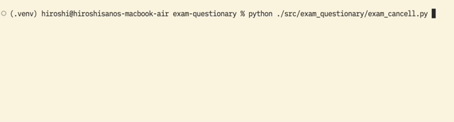

## このリポジトリについて

questionayの使い方サンプルです。

## 使い方

* このリポジトリをクローンします。
* pip or ryeを使って、questionaryをインストールします。
* 仮想環境上で `src/exam_questionary/`ディレクトリ内のスクリプトを実行します。

## サンプルコードの動作の様子

gif動画にしてみました。

### [src/exam_questionary/exam_simple.py](src/exam_questionary/exam_simple.py)

### [src/exam_questionary/exam_select.py](src/exam_questionary/exam_select.py)

### [src/exam_questionary/exam_choice.py](src/exam_questionary/exam_choice.py)

### [src/exam_questionary/exam_cancel.py](src/exam_questionary/exam_cancel.py)

### [src/exam_questionary/exam_skip.py](src/exam_questionary/exam_skip.py)

### [src/exam_questionary/exam_default.py](src/exam_questionary/exam_default.py)

